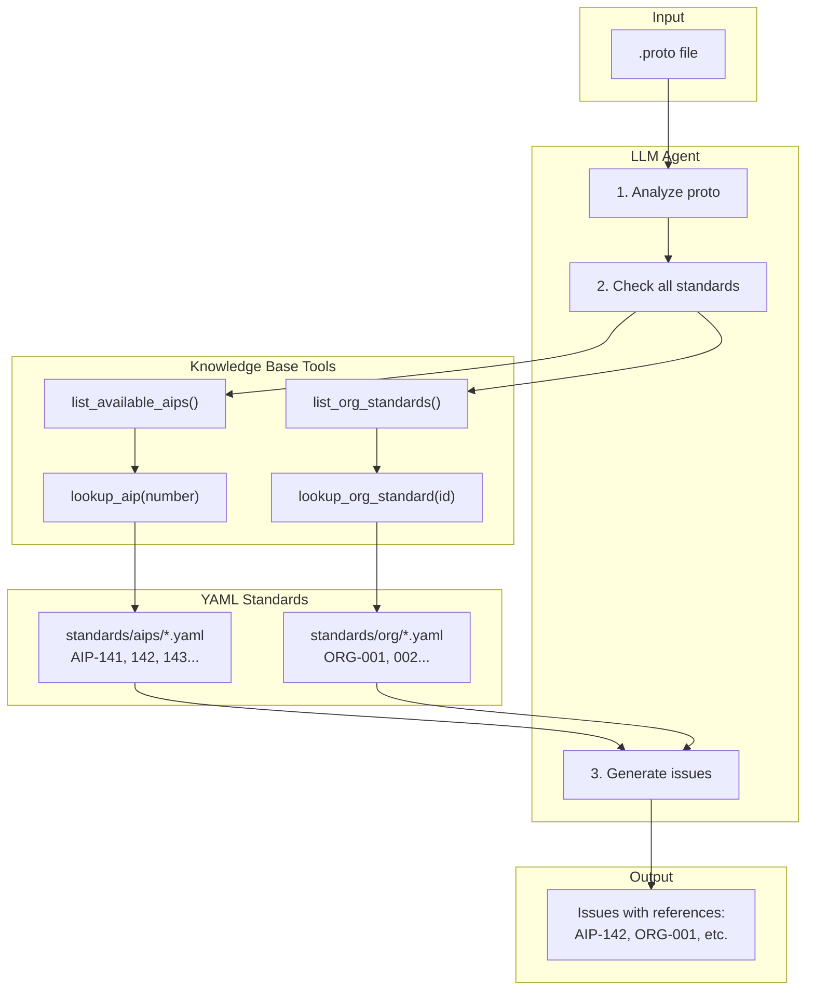

# Proto Semantic Reviewer

An AI-powered agent that reviews Protocol Buffer definitions for **semantic correctness** against [Google AIP (API Improvement Proposals)](https://google.aip.dev/) standards and event messaging best practices.

## What It Does

Traditional linters like `buf lint` and `api-linter` check syntactic rules—naming conventions, missing annotations, field numbers. This tool goes deeper, checking **semantic** issues that require understanding the *meaning* of your messages:

- **Organizational standards**: Custom semantic rules (e.g., event_id for idempotency) that extend AIPs
- **Type appropriateness**: Is `string created_at` really the right choice, or should it be `google.protobuf.Timestamp`?
- **Well-known type usage**: Is `double price` correct, or should it be `google.type.Money`?
- **Enum safety**: Does your enum have an `UNSPECIFIED = 0` value for forward compatibility?
- **Schema evolution**: Are your messages designed for safe evolution over time?

## How It Works

The reviewer uses an LLM agent with access to a bundled knowledge base of AIP and organizational standards. The agent autonomously decides which standards to look up based on patterns it detects in your proto.



**Both AIPs and ORGs are just "standards":**
- **AIPs** = Google's universal best practices
- **ORGs** = Your organization's custom rules

Each ORG standard has an `applies_to` field (e.g., "messages ending in Event") that the agent checks to determine relevance.

**Example: Multiple standards apply to one message**

```protobuf
message OrderCreatedEvent {
  string order_id = 1;      // ORG-001: Missing event_id (if applies_to matches)
  string created_at = 2;    // AIP-142: Should be Timestamp
  double price = 3;         // AIP-143: Should be Money
}
```

**Key points:**
- **Standards are equal**: AIPs and ORGs are both just standards from different sources
- **ORG applicability**: Each ORG defines its own `applies_to` pattern
- **Multiple violations**: One message can violate any combination of standards
- **Local YAML files**: All standards loaded from `standards/` directory

## Features

- **Multi-Provider LLM Support**: Works with Gemini, OpenAI, or Anthropic
- **AIP Standards**: Universal Google AIP compliance (timestamps, enums, field behavior)
- **Organizational Standards**: Extensible ORG-XXX rules for your organization's requirements
- **HTTP API**: FastAPI server with OpenAPI documentation
- **MCP Server**: IDE integration for IntelliJ, VS Code, and other MCP-compatible tools
- **Optional Authorization**: AD group-based access control via header
- **Enterprise Ready**: Custom endpoints, HTTP headers, and CA certificates for corporate proxies
- **Docker Ready**: Run anywhere with Docker Compose
- **CLI & Programmatic**: Use from command line or integrate into your Python code
- **Structured Output**: Get JSON results for easy CI integration

## Quick Start (Local)

```bash
# 1. Create virtualenv and install
python3 -m venv .venv
source .venv/bin/activate
pip install -e ".[openai,server]"  # or [anthropic,server] or [gemini,server]

# 2. Set your API key (pick one)
export OPENAI_API_KEY=your-key
# or: export ANTHROPIC_API_KEY=your-key
# or: export GOOGLE_API_KEY=your-key

# 3. Review a proto file
python -m src review path/to/your.proto

# 4. Or start the HTTP server
python -m src server
# API docs at http://localhost:8000/docs
```

### CLI Commands

```bash
# Review with different output formats
python -m src review file.proto              # Structured text output
python -m src review file.proto --format json # JSON output
python -m src review file.proto --raw         # Raw LLM response

# Review focus modes
python -m src review file.proto --focus event # Event messaging (default)
python -m src review file.proto --focus rest  # REST APIs

# Browse standards
python -m src list-aips                       # List all AIP standards
python -m src lookup-aip 142                  # Look up specific AIP
python -m src list-org-standards              # List org standards

# Pipe from stdin
cat file.proto | python -m src review -
```

## Quick Start (Docker)

No local Python installation required. Just Docker.

```bash
# Clone the repository
git clone https://github.com/your-org/proto-semantic-reviewer.git
cd proto-semantic-reviewer

# Set your API key (at least one required)
export OPENAI_API_KEY=your-key
# or: export ANTHROPIC_API_KEY=your-key
# or: export GOOGLE_API_KEY=your-key

# Start the HTTP server
docker-compose up proto-reviewer

# The server is now running at http://localhost:8000
# Open http://localhost:8000/docs for interactive API documentation
```

### Review via HTTP API

```bash
# Review a proto file from disk (simplest approach)
jq -Rs '{proto_content: .}' path/to/your.proto | \
  curl -X POST http://localhost:8000/review \
    -H "Content-Type: application/json" \
    -d @-

# Review inline proto content
curl -X POST http://localhost:8000/review \
  -H "Content-Type: application/json" \
  -d '{
    "proto_content": "syntax = \"proto3\";\n\nmessage OrderCreated {\n  string order_id = 1;\n  string created_at = 2;\n}"
  }'

# Review with a specific provider and model
curl -X POST "http://localhost:8000/review?provider=openai&model=gpt-4-turbo" \
  -H "Content-Type: application/json" \
  -d '{"proto_content": "..."}'

# Check server health
curl http://localhost:8000/health
```

### Review via CLI (Docker)

```bash
# Review a proto file
docker-compose run --rm proto-reviewer review /examples/events/bad_event.proto

# Get JSON output
docker-compose run --rm proto-reviewer review /examples/events/bad_event.proto --format json

# Use a specific provider
docker-compose run --rm proto-reviewer review /examples/events/bad_event.proto --provider openai

# List organizational standards
docker-compose run --rm proto-reviewer list-org-standards

# List AIPs
docker-compose run --rm proto-reviewer list-aips
```

See [examples/curl_examples.md](examples/curl_examples.md) for more detailed examples.

---

## Local Installation (Optional)

### macOS (python3 + virtualenv)

macOS doesn't have a `python` command by default. Use `python3`:

```bash
# Create and activate virtual environment
python3 -m venv venv
source venv/bin/activate

# Install with your preferred provider(s)
pip install -e ".[gemini,server]"      # Gemini + HTTP server
# or: pip install -e ".[openai,server]"   # OpenAI + HTTP server
# or: pip install -e ".[full]"            # All providers + server

# Set your API key
export GOOGLE_API_KEY=your-key

# Start the HTTP server
python3 -m src server --port 8000

# Or review a file directly
python3 -m src review path/to/your.proto
```

### Linux (with python symlink)

```bash
# Create virtual environment
python -m venv venv
source venv/bin/activate

# Install and run
pip install -e ".[gemini,server]"
export GOOGLE_API_KEY=your-key
python -m src server --port 8000
```

---

## Supported Providers

| Provider | Environment Variable | Default Model |
|----------|---------------------|---------------|
| Gemini | `GOOGLE_API_KEY` | gemini-2.0-flash |
| OpenAI | `OPENAI_API_KEY` | gpt-4o |
| Anthropic | `ANTHROPIC_API_KEY` | claude-sonnet-4-20250514 |

The agent auto-detects which provider to use based on available API keys. Override with `MODEL_PROVIDER` environment variable or `--provider` CLI flag.

---

## Example Output

```
Found 5 issue(s): 2 error(s), 2 warning(s), 1 suggestion(s)

✗ [ERROR] OrderCreated.created_at
  Issue: Timestamp field uses string type instead of google.protobuf.Timestamp
  Recommendation: Change to google.protobuf.Timestamp for type safety and precision
  Reference: AIP-142

✗ [ERROR] OrderCreated.total
  Issue: Monetary amount uses double type which can cause precision errors
  Recommendation: Use google.type.Money or a custom Money message with units and nanos
  Reference: None

⚠ [WARNING] OrderCreated
  Issue: Event message missing event_id field for idempotency
  Recommendation: Add string event_id field for deduplication
  Reference: ORG-001

Summary: Found 3 issues: 2 errors related to type usage (AIP-142), 1 warning about missing event_id (ORG-001)
```

---

## Standards

### AIP Standards (Universal)

Google AIPs define universal best practices for all Protocol Buffers:

| AIP | Title | Key Checks |
|-----|-------|------------|
| AIP-140 | Field Names | Standard naming (create_time vs created_at) |
| AIP-141 | Quantities | Integer types for counts, avoid float |
| AIP-142 | Time and Duration | Timestamp/Duration types |
| AIP-143 | Standardized Codes | google.type.Money, LatLng, Date |
| AIP-148 | Standard Fields | create_time, update_time, etag, uid |
| AIP-151 | Long-Running Operations | Operation patterns |
| AIP-154 | Resource Freshness | etag usage |
| AIP-155 | Request Identification | request_id patterns |
| AIP-180 | Backwards Compatibility | Enum UNSPECIFIED values |
| AIP-191 | File Layout | Proto file organization |
| AIP-203 | Field Behavior | OUTPUT_ONLY, REQUIRED, IMMUTABLE |

Use `--focus rest` to include additional REST/resource-oriented AIPs (4, 121-123, 131-135, 158).

### Organizational Standards (ORG-XXX)

Extensible organization-specific rules that extend AIPs:

| Standard | Title | Key Checks |
|----------|-------|------------|
| ORG-001 | Event Identification | event_id for idempotency in event messages |

Add your own organizational standards in `src/knowledge/org_standards.py`.

---

## HTTP API Reference

| Endpoint | Method | Description |
|----------|--------|-------------|
| `/review` | POST | Review proto content (structured JSON response) |
| `/review/raw` | POST | Review proto content (raw text response) |
| `/health` | GET | Health check with available providers |
| `/providers` | GET | List supported and available providers |
| `/docs` | GET | Swagger UI documentation |
| `/redoc` | GET | ReDoc documentation |

### Query Parameters for /review

| Parameter | Type | Default | Description |
|-----------|------|---------|-------------|
| `provider` | string | auto | LLM provider (gemini, openai, anthropic) |
| `model` | string | provider default | Specific model name |
| `focus` | string | event | Review focus (event or rest) |

---

## MCP Server (IDE Integration)

The reviewer can run as an MCP (Model Context Protocol) server for integration with IDEs like IntelliJ, VS Code, and other MCP-compatible tools.

### Running the MCP Server

```bash
# STDIO mode (default) - for local IDE plugins
python3 -m src mcp

# HTTP mode - for network access
python3 -m src mcp --http --port 3000

# Via Docker
docker-compose --profile mcp up proto-reviewer-mcp
```

### Available MCP Tools

| Tool | Description |
|------|-------------|
| `review_proto` | Review proto content for semantic issues |
| `list_aips` | List available AIP standards |
| `list_org_standards` | List available organizational standards |
| `lookup_aip` | Get details for a specific AIP |
| `lookup_org_standard` | Get details for a specific ORG standard |

### IDE Configuration

**VS Code** (`.vscode/mcp.json`):
```json
{
  "servers": {
    "proto-reviewer": {
      "command": "python3",
      "args": ["-m", "src", "mcp"]
    }
  }
}
```

**IntelliJ** (`claude_desktop_config.json`):
```json
{
  "mcpServers": {
    "proto-reviewer": {
      "command": "python3",
      "args": ["-m", "src", "mcp"]
    }
  }
}
```

---

## Programmatic Usage

```python
from src import review_proto, review_proto_structured, ReviewContext, ReviewResult

# Simple review (returns ReviewResult with text content)
result = review_proto(proto_content)
print(result.content)  # The review text
print(result.provider_name)  # e.g., "openai"
print(result.model_name)  # e.g., "gpt-4o"

# With specific provider
result = review_proto(proto_content, provider="openai")

# Using ReviewContext for more control
context = ReviewContext(
    provider="anthropic",
    focus="rest",
    max_iterations=15,
)
result = review_proto(proto_content, context=context)

# Structured review (returns ReviewResult with dict content)
result = review_proto_structured(proto_content, focus="event")
for issue in result.content["issues"]:
    print(f"[{issue['severity']}] {issue['location']}: {issue['issue']}")
```

---

## CI Integration

### GitHub Actions

```yaml
name: Proto Semantic Review

on:
  pull_request:
    paths:
      - '**/*.proto'

jobs:
  review:
    runs-on: ubuntu-latest
    steps:
      - uses: actions/checkout@v4

      - name: Review protos
        env:
          GOOGLE_API_KEY: ${{ secrets.GOOGLE_API_KEY }}
        run: |
          docker-compose run --rm proto-reviewer review /protos --format json
```

### GitLab CI

```yaml
proto-review:
  image: docker/compose:latest
  services:
    - docker:dind
  script:
    - docker-compose run --rm proto-reviewer review /protos --format json
  rules:
    - changes:
        - "**/*.proto"
```

---

## Architecture

```
proto-semantic-reviewer/
├── src/
│   ├── __init__.py              # Package exports
│   ├── __main__.py              # CLI entry point
│   ├── agent.py                 # Core agent logic
│   ├── tools.py                 # Agent tools
│   ├── prompts.py               # System prompts (event/REST focused)
│   ├── tool_definitions.py      # Provider-agnostic tool declarations
│   ├── server.py                # FastAPI HTTP server
│   ├── mcp_server.py            # MCP server for IDE integration
│   ├── auth.py                  # AD group authorization middleware
│   ├── adapters/
│   │   ├── base.py              # Abstract adapter interface
│   │   ├── factory.py           # Adapter factory with auto-detection
│   │   ├── gemini_adapter.py    # Gemini implementation
│   │   ├── openai_adapter.py    # OpenAI implementation
│   │   └── anthropic_adapter.py # Anthropic implementation
│   └── knowledge/
│       ├── loader.py            # YAML standards loader
│       └── wellknown_types.py   # Type recommendations
├── standards/                   # YAML-based standards (editable!)
│   ├── aips/                    # AIP standards
│   │   ├── aip-141.yaml
│   │   ├── aip-142.yaml
│   │   ├── aip-143.yaml
│   │   └── ...
│   └── org/                     # Organizational standards
│       └── org-001.yaml
├── examples/
│   ├── events/                  # Example proto files
│   └── curl_examples.md         # HTTP API examples
├── docker-compose.yml           # Local dev setup
├── Dockerfile                   # Container build
└── pyproject.toml               # Package config with optional deps
```

---

## Configuration

### Environment Variables

| Variable | Required | Default | Description |
|----------|----------|---------|-------------|
| `GOOGLE_API_KEY` | One of three | - | Google AI API key for Gemini |
| `OPENAI_API_KEY` | One of three | - | OpenAI API key |
| `ANTHROPIC_API_KEY` | One of three | - | Anthropic API key |
| `MODEL_PROVIDER` | No | auto-detect | Force a specific provider |
| `MAX_ITERATIONS` | No | 10 | Max agent tool-use iterations |
| `MAX_INPUT_SIZE` | No | 102400 | Max proto content size in bytes (100KB) |
| `LLM_TIMEOUT` | No | 120 | LLM API call timeout in seconds |
| `LOG_LEVEL` | No | INFO | Logging level (DEBUG, INFO, WARNING, ERROR) |
| `LOG_FORMAT` | No | text | Set to `json` for structured JSON logs |
| `ALLOWED_AD_GROUPS` | No | - | Comma-separated list of AD groups for authorization |
| `STANDARDS_DIR` | No | `./standards` | Path to custom standards directory |

### Advanced: Custom Endpoints, Headers, and Certificates

For enterprise environments with API proxies, custom headers, or internal CA certificates, each provider supports per-provider configuration.

**Custom Base URLs** (for API proxies or self-hosted endpoints):

| Variable | Example | Description |
|----------|---------|-------------|
| `OPENAI_BASE_URL` | `https://proxy.corp.com/openai/v1` | Override OpenAI API endpoint |
| `ANTHROPIC_BASE_URL` | `https://proxy.corp.com/anthropic` | Override Anthropic API endpoint |
| `GEMINI_BASE_URL` | `https://proxy.corp.com/gemini` | Override Gemini API endpoint (limited support) |

**Custom HTTP Headers** (for authentication, tracing, etc.):

Headers are configured via environment variables matching the pattern `{PROVIDER}_HEADER_{NAME}=value`:
- Single underscore `_` becomes a hyphen `-`
- Double underscore `__` becomes a literal underscore `_`

| Environment Variable | Resulting Header |
|---------------------|------------------|
| `OPENAI_HEADER_X_Request_Id=123` | `X-Request-Id: 123` |
| `OPENAI_HEADER_Content_Type=json` | `Content-Type: json` |
| `OPENAI_HEADER_X__Underscore__Name=val` | `X_Underscore_Name: val` |
| `OPENAI_HEADER_X_Mixed__Style_Name=val` | `X-Mixed_Style-Name: val` |

```bash
# Hyphenated headers (most common) - use single underscores
export OPENAI_HEADER_X_Request_Id=my-trace-id      # → X-Request-Id
export OPENAI_HEADER_Content_Type=application/json # → Content-Type

# Underscored headers (rare) - use double underscores
export OPENAI_HEADER_X__Custom__Header=value       # → X_Custom_Header
```

**Custom CA Certificates** (for corporate proxies or self-signed certs):

| Variable | Example | Description |
|----------|---------|-------------|
| `OPENAI_CA_BUNDLE` | `/etc/ssl/certs/corp-ca.pem` | CA cert bundle for OpenAI |
| `ANTHROPIC_CA_BUNDLE` | `/etc/ssl/certs/corp-ca.pem` | CA cert bundle for Anthropic |
| `GEMINI_CA_BUNDLE` | `/etc/ssl/certs/corp-ca.pem` | CA cert bundle for Gemini |
| `LLM_CA_BUNDLE` | `/etc/ssl/certs/corp-ca.pem` | Fallback CA cert for all providers |
| `SSL_CERT_FILE` | `/etc/ssl/certs/ca-certificates.crt` | Standard OpenSSL env var (auto-detected) |
| `REQUESTS_CA_BUNDLE` | `/etc/pki/tls/certs/ca-bundle.crt` | Common Python env var (auto-detected) |

**Precedence order:** Provider-specific → `LLM_CA_BUNDLE` → `SSL_CERT_FILE` → `REQUESTS_CA_BUNDLE`

If your environment already sets `SSL_CERT_FILE` or `REQUESTS_CA_BUNDLE` (common in enterprise setups), the tool will automatically use them—no additional configuration needed.

**Docker: CA bundle paths are inside the container.** Mount host certificates as a volume:

```yaml
# docker-compose.yml
services:
  proto-reviewer:
    volumes:
      - /host/path/to/corp-ca.pem:/etc/ssl/certs/custom-ca.pem:ro
    environment:
      - LLM_CA_BUNDLE=/etc/ssl/certs/custom-ca.pem
```

**Example: Corporate proxy with custom CA:**

```bash
# Route through corporate proxy with custom certificates
export OPENAI_BASE_URL=https://api-proxy.corp.internal/openai/v1
export OPENAI_CA_BUNDLE=/etc/ssl/certs/corp-root-ca.pem
export OPENAI_HEADER_X_Corp_Auth=internal-token

# Start the server
python -m src server
```

### Custom Standards

Standards are loaded from YAML files, making them easy to customize without code changes.

**Directory structure:**
```
standards/
├── aips/           # AIP standards (universal)
│   ├── aip-141.yaml
│   ├── aip-142.yaml
│   └── ...
└── org/            # Organizational standards (your rules)
    └── org-001.yaml
```

**Adding a custom organizational standard:**

```yaml
# standards/org/org-002.yaml
id: ORG-002
title: Correlation Required
summary: |
  All event messages must include correlation_id for distributed tracing.

applies_to: "messages ending in Event"

related_aips:
  - AIP-155

rules:
  - id: ORG-002-CORRELATION-ID
    description: Event messages must have correlation_id field
    check_guidance: Check for correlation_id or trace_id in event messages
    violations:
      - "Missing correlation_id entirely"
      - "Using request_id instead of correlation_id"
```

**Using custom standards with Docker:**

```bash
# Mount your standards directory
docker-compose run --rm \
  -v ./my-standards:/app/standards:ro \
  proto-reviewer review /protos/my.proto

# Or set STANDARDS_DIR
export STANDARDS_DIR=/path/to/my-standards
docker-compose up proto-reviewer
```

### Authorization

The server supports optional AD group-based authorization. When `ALLOWED_AD_GROUPS` is set, requests must include an `X-AD-Memberships` header with at least one matching group.

```bash
# Enable authorization
export ALLOWED_AD_GROUPS=platform-team,backend-team

# Start server
docker-compose up proto-reviewer

# Request with authorization header
curl -X POST http://localhost:8000/review \
  -H "Content-Type: application/json" \
  -H "X-AD-Memberships: platform-team,other-team" \
  -d '{"proto_content": "..."}'
```

**Trust Model**: The server trusts the `X-AD-Memberships` header. This assumes an upstream gateway/proxy validates the user's identity and sets the header based on validated AD group membership.

### Installation Extras

```bash
pip install -e ".[gemini]"      # Gemini only
pip install -e ".[openai]"      # OpenAI only
pip install -e ".[anthropic]"   # Anthropic only
pip install -e ".[server]"      # FastAPI server
pip install -e ".[mcp]"         # MCP server for IDE integration
pip install -e ".[validation]"  # Proto syntax validation (grpcio-tools)
pip install -e ".[full]"        # All providers + server + MCP + validation
pip install -e ".[dev]"         # Development dependencies
```

---

## Development

```bash
# Using Docker (recommended)
docker-compose --profile dev up proto-reviewer-dev

# Or locally with virtualenv (macOS)
python3 -m venv venv
source venv/bin/activate
pip install -e ".[full,dev]"

# Run tests
pytest

# Run tests with coverage
pytest --cov=src --cov-report=html
```

---

## Limitations

- **Requires API access**: The agent needs access to at least one LLM provider
- **Not a replacement for syntactic linters**: Use alongside `buf lint` and `api-linter`
- **AI limitations**: May occasionally miss issues or flag false positives
- **Proto3 focused**: Primarily designed for proto3 syntax

## Contributing

Contributions are welcome! Please:

1. Fork the repository
2. Create a feature branch
3. Add tests for new functionality
4. Ensure all tests pass
5. Submit a pull request

## License

MIT License - see LICENSE file for details.

## Acknowledgments

- [Google AIPs](https://google.aip.dev/) for the API design standards
- [Buf](https://buf.build/) for inspiration on proto tooling
- [Google AI](https://ai.google.dev/), [OpenAI](https://openai.com/), and [Anthropic](https://anthropic.com/) for the LLM APIs
